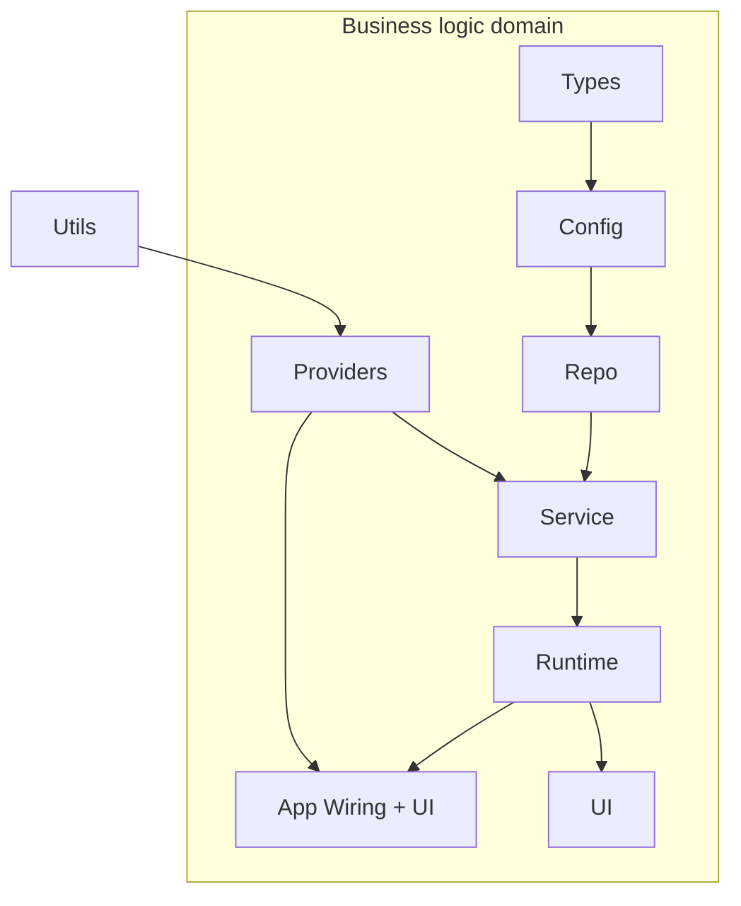

# Layered Architecture Evolution Plan

## Intent
Define a clean, explicitly layered architecture for Backup Service Home and a practical migration path from the current structure to that target.

The target follows your pattern: a business domain with strict layer boundaries and explicit cross-cutting entry points.

## Target layer model

## Layer responsibilities and mapping to current codebase

### Utils (cross-cutting primitives)
Responsibility:
- pure helpers and technical primitives (path helpers, date helpers, hashing/encryption primitives, OS wrappers)
- no business decisions

Current mapping:
- `BSH.Engine/Utils/*`
- parts of `BSH.Engine/Security/*`
- low-level OS wrappers like `Win32Stuff`

Target rule:
- consumable by Providers (and only by exception by other layers through ports)

### Types (domain model + contracts)
Responsibility:
- domain enums, records, value objects, status/result contracts
- no I/O, no framework dependencies

Current mapping:
- `BSH.Engine/Models/*`
- `BSH.Engine/ActionType.cs`, `BSH.Engine/TaskType.cs`, `BSH.Engine/Enums.cs`
- operation result types (`JobState`, overwrite enums)

Target rule:
- stable type system shared across all other business layers

### Config (policy + runtime settings abstraction)
Responsibility:
- typed access to configuration and policy
- no SQL/storage details

Current mapping:
- `IConfigurationManager`, `ConfigurationManager`
- shell settings wrappers in `BSH.MainApp.Services.LocalSettingsService`, WinForms `Settings`

Target rule:
- Config depends on Types only
- persistence for config values lives in Repo/Providers

### Repo (data access)
Responsibility:
- all persistence queries and writes
- query/read models and command/write repositories

Current mapping:
- `DbClient`, `DbClientFactory`, `DbMigrationService`
- large query/write logic currently in `QueryManager` and partially in job classes

Target rule:
- Repo owns SQL and transaction boundaries
- Services call repos through interfaces only

### Service (use-case orchestration)
Responsibility:
- use cases: backup, restore, delete, modify, schedule planning
- state transitions and business invariants

Current mapping:
- `BackupService`
- substantial logic in `BackupJob`, `RestoreJob`, `DeleteJob`, `DeleteSingleJob`, `EditJob`

Target rule:
- Service depends on Types, Config, Repo, and Provider ports
- no direct UI framework code

### Runtime (execution engine)
Responsibility:
- job execution runtime: cancellation, progress pipeline, retries, conflict policy application
- deterministic orchestration host used by both shells and scheduled triggers

Current mapping:
- split between `BackupService`, job classes, `JobService`, `BackupController`, `StatusService`/`StatusController`

Target rule:
- Runtime is the single engine for executing Service commands
- Runtime emits typed events (progress/state/errors) to UI adapters

### UI
Responsibility:
- render state, collect user intent, show dialogs

Current mapping:
- WinUI: `BSH.MainApp/Views`, `ViewModels`, `Windows`
- WinForms: `BSH.Main/Dialogs`, controllers around dialogs

Target rule:
- UI depends on Runtime event contracts, not on Repo or Providers

### App Wiring + UI (composition root)
Responsibility:
- DI wiring, startup lifecycle, binding concrete adapters to ports

Current mapping:
- `BSH.MainApp/App.xaml.cs`
- `BSH.Main/Program.cs` + static wiring in `BackupLogic`

Target rule:
- only composition root may bind interfaces to concrete implementations

### Providers (external system adapters)
Responsibility:
- adapters to external systems: storage, scheduler, VSS service, OS notifications, media watching

Current mapping:
- `Storage/*`, `SchedulerService`, `VolumeShadowCopyService`, `UsbWatchService`
- `BSH.Service` / `BSH.Service.Shared` for VSS IPC

Target rule:
- Providers implement ports consumed by Service/Runtime
- Providers contain all framework- or protocol-specific code

## Dependency rules (hard boundaries)

1. UI must not reference Repo implementations or SQL types.
2. Service/Runtime must not reference WinUI/WinForms types.
3. Repo must not call UI callbacks directly.
4. Providers must not contain business decisions (only adapter behavior).
5. Types must remain dependency-free (except BCL primitives).
6. Composition root is the only place where concrete classes are wired together.

## Proposed target project layout

- `BSH.Domain.Types`
- `BSH.Domain.Config`
- `BSH.Domain.Repo`
- `BSH.Domain.Service`
- `BSH.Domain.Runtime`
- `BSH.Providers` (with sub-namespaces: Storage, Scheduler, Vss, Os)
- `BSH.App.WinUI` (current `BSH.MainApp`)
- `BSH.App.WinForms` (current `BSH.Main`, optional legacy)

Transitional note:
- Start with namespace/folder boundaries inside `BSH.Engine` before physical project extraction.

## Migration plan (incremental)

### Phase 1: Boundary declaration (no behavior change)
- Introduce folders/namespaces reflecting target layers inside `BSH.Engine`.
- Add explicit interfaces for provider ports (`IStorageProvider`, `IVssClient`, `ISchedulerAdapter`, `IMediaWatcher`).
- Move direct UI calls out of engine paths into status/event ports.

Exit criteria:
- Engine compiles with no UI-framework references.

### Phase 2: Runtime unification
- Create a single runtime execution pipeline (`JobRuntime`) used by both WinUI and WinForms.
- Move duplicated preflight logic (media/password/cancellation gating) from `JobService` and `BackupController` into Runtime.
- Normalize terminal states (use `CANCELED` explicitly).

Exit criteria:
- Same use-case path is used by manual and scheduled runs.

### Phase 3: Repo extraction
- Move SQL and transaction logic out of job classes into repository classes.
- Split read/write concerns:
  - version query repo
  - backup mutation repo
  - schedule repo

Exit criteria:
- Job/use-case classes contain no raw SQL.

### Phase 4: Provider isolation
- Move concrete storage/scheduler/VSS/USB implementations behind adapter interfaces.
- Keep `BSH.Service` boundary as a provider implementation detail.

Exit criteria:
- Service layer depends only on provider interfaces.

### Phase 5: App wiring cleanup
- Restrict DI registration and concrete instantiation to composition roots.
- Remove static/global orchestration from legacy pathways where possible.

Exit criteria:
- No `new` of infrastructure classes in domain/service code.

## Cross-cutting boundaries (explicit)

### Observability
- Logging, metrics, trace correlation via a shared telemetry port.
- No direct `Serilog` calls in Types; Service/Runtime logs through abstraction.

### Security
- encryption/hash/password handling via dedicated security service ports.
- password persistence remains app-side adapter detail.

### Time and scheduling
- use a clock abstraction for deterministic behavior in runtime logic.
- scheduler adapter translates schedule entries to triggers.

### Error model
- convert technical exceptions to typed domain failures at layer boundaries.
- UI receives user-facing error categories, not raw provider exceptions.

## Architectural invariants to enforce in CI

1. No reference from UI projects to Repo/Provider concrete assemblies.
2. No reference from Domain Types to any app/provider assembly.
3. No direct SQL outside Repo layer.
4. No WinUI/WinForms namespaces in Domain Runtime/Service.
5. One active job per runtime instance unless explicitly configured for concurrency.

Implementation suggestion:
- add architecture tests (for example with NetArchTest or custom Roslyn analyzers) to enforce namespace/project dependency rules.

## Practical first refactor targets in this repository

1. Extract shared preflight orchestration from:
- `BSH.MainApp.Services.JobService`
- `BSH.Main.Modules.BackupController`

2. Isolate SQL from:
- `BSH.Engine.Jobs.BackupJob`
- `BSH.Engine.Jobs.RestoreJob`
- `BSH.Engine.Jobs.DeleteJob`
- `BSH.Engine.Jobs.DeleteSingleJob`

3. Introduce provider ports around:
- `BSH.Engine.Storage.*`
- `BSH.Engine.Services.SchedulerService`
- `BSH.Engine.Services.VolumeShadowCopyService`
- `BSH.Engine.Services.UsbWatchService`

4. Normalize state semantics across both shells:
- use `JobState.CANCELED` for cancellation terminal path
- keep error aggregation behavior consistent

## Outcome
After these phases, the codebase has:
- explicit and enforceable layer boundaries
- one reusable runtime for all execution paths
- isolated infrastructure adapters
- UI shells that are replaceable without touching business logic
- lower duplication and easier testing of job behavior
