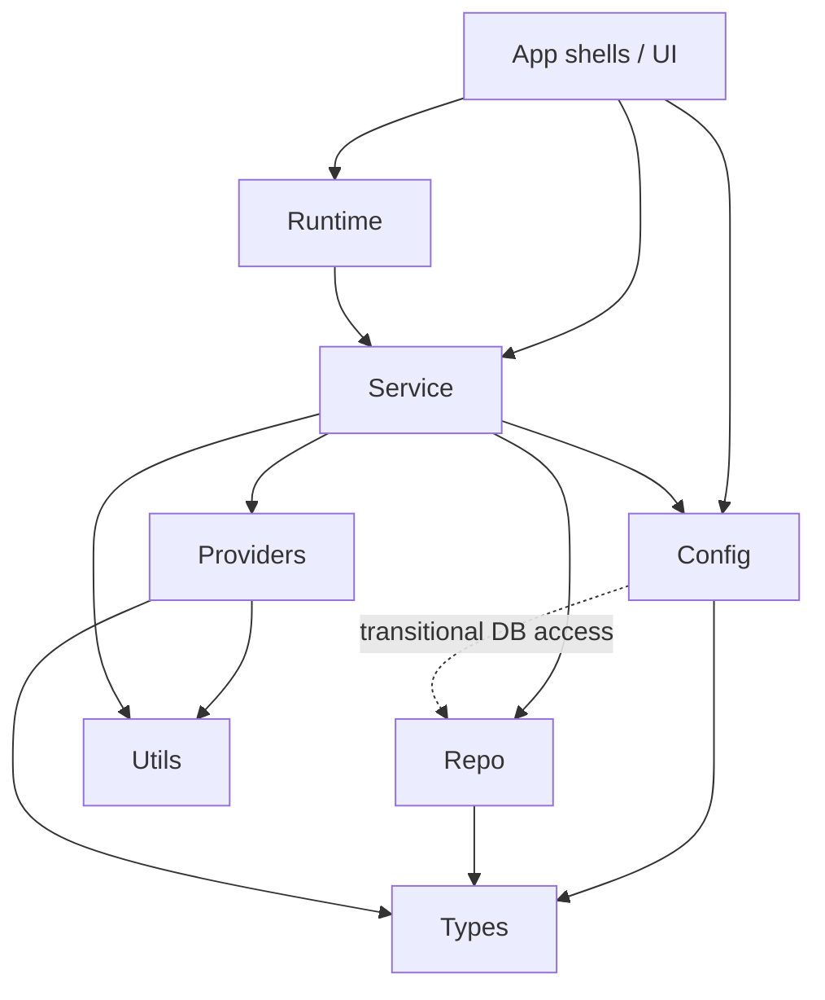

# BSH.Engine Layered Architecture

`BSH.Engine` is organized as an explicitly layered business core. Folders and namespaces match the same layer names so dependency direction is visible in the tree and in `using` statements.

## Layer map

```text
BSH.Engine/
├── Types/                 # Domain models, enums, job contracts, exceptions
├── Config/                # Configuration policy (IConfigurationManager)
├── Repo/                  # Persistence: Database, QueryManager, repositories, mappers
├── Service/               # Use cases: BackupService, Jobs, FileCollector, schedule policy
├── Runtime/               # Shared job execution pipeline (JobRuntime, session ports)
├── Providers/             # External adapters (Storage, Scheduler, Media, Vss) + Ports
├── Utils/                 # Pure helpers + security/OS primitives
├── Properties/
└── Resources/
```



## Layer responsibilities

| Layer | Namespace root | Owns | Must not |
| --- | --- | --- | --- |
| **Types** | `Brightbits.BSH.Engine.Types` | Enums, models, `IJobReport`, job state/overwrite contracts, domain exceptions | I/O, SQL, UI, provider SDKs |
| **Config** | `Brightbits.BSH.Engine.Config` | Typed backup settings access | Storage/protocol details, UI |
| **Repo** | `Brightbits.BSH.Engine.Repo` | SQLite client/migrations, query/mutation repositories, reader mappers | UI frameworks, storage protocols |
| **Service** | `Brightbits.BSH.Engine.Service` | Backup/restore/delete/edit use cases and job workflows | WinUI/WinForms types, raw provider SDKs when a port exists |
| **Runtime** | `Brightbits.BSH.Engine.Runtime` | Cancellation, media/password preflight, shared session runner | SQL, storage implementations |
| **Providers** | `Brightbits.BSH.Engine.Providers.*` | Filesystem/FTP storage, Quartz scheduler, USB watcher, VSS named-pipe client | Business policy decisions |
| **Utils** | `Brightbits.BSH.Engine.Utils` | Path/date/compression helpers, crypto/hash, Win32 wrappers | Business workflows |

## Dependency rules

1. **Types** depend only on BCL primitives.
2. **Providers** implement ports under `Providers.Ports`; Service/Runtime consume ports, not concrete protocol details where ports already exist.
3. **Repo** owns SQL and transaction boundaries; `FromReader*` mapping lives in Repo mappers, not in Types.
4. **Runtime** is the shared execution host used by both WinUI and WinForms shells.
5. Composition roots (`BSH.MainApp/App.xaml.cs`, `BSH.Main`/`BackupLogic`) are the only places that wire concrete provider/repo implementations into interfaces.

## Mapping from previous layout

| Previous | Current layer |
| --- | --- |
| `Models/`, root enums, `Jobs/{JobState,IJobReport,...}`, `Exceptions/` | `Types/` |
| `ConfigurationManager`, `Contracts/IConfigurationManager` | `Config/` |
| `Database/`, `QueryManager`, `Repo/`, related contracts | `Repo/` |
| `Services/BackupService`, `Jobs/*Job`, `FileCollector`, schedule policy services | `Service/` |
| `Storage/`, scheduler/USB/VSS services | `Providers/{Storage,Scheduler,Media,Vss}` |
| `Security/`, `Win32`, `Utils/` | `Utils/` (+ `Utils/Security`) |

## Related docs

- High-level product architecture: [`../ARCHITECTURE.md`](../ARCHITECTURE.md)
- Migration roadmap: [`../../docs/design-docs/layered-architecture-evolution.md`](../../docs/design-docs/layered-architecture-evolution.md)
- Job runtime semantics: [`../../docs/design-docs/job-system.md`](../../docs/design-docs/job-system.md)
